# Incident Response Report: Operation "Easter Bunny" Ransomware

* **Role:** Security Analyst / Incident Responder
* **Date:** December 2025
* **Tools:** Splunk Enterprise, SPL (Search Processing Language)
* **Incident Type:** Ransomware & Data Exfiltration

## 1. Executive Summary
**Objective**
The TBFC SOC team detected a ransomware incident involving a threat actor identified as "King Malhare." The objective of this investigation was to utilize Splunk to analyze web and firewall logs, reconstruct the attack chain, and determine the scope of the compromise.

**Key Findings**
The investigation confirmed a full system compromise originating from a web server (`10.10.1.15`). The attacker (`198.51.100.55`) exploited a vulnerability to upload a web shell, executed a ransomware payload (`bunnylock.bin`), and successfully exfiltrated critical data to a Command & Control (C2) server.

**Impact**
* **Confidentiality:** Large volumes of sensitive data (logs and configs) were exfiltrated.
* **Integrity:** System files were encrypted by the `bunnylock` ransomware.
* **Availability:** Critical business services were disrupted during the holiday season.

---

## 2. Investigation Methodology
The investigation followed the **SANS Incident Response process**, focusing on **Identification** and **Analysis**.

### Phase 1: Initial Triage & Anomaly Detection
I began by analyzing the log volume to identify the timeframe of the attack. 

**Log Source Identification:**
I first verified the data sources available, identifying `web_traffic` (Web Server) and `firewall_logs` (Network) as the key datasets.
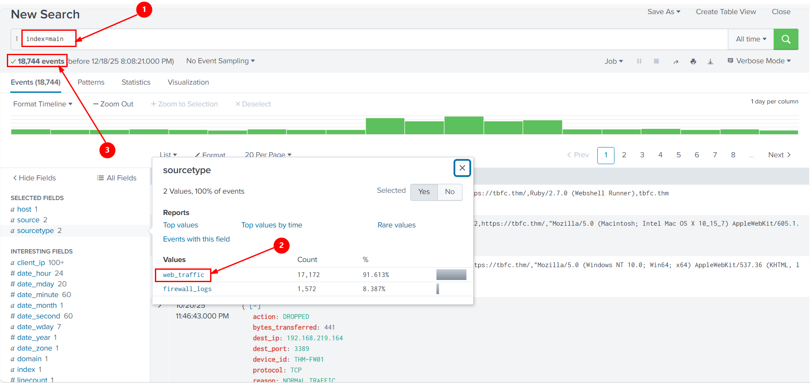

**Timeline Analysis:**
Using `timechart`, I visualized the traffic distribution. A massive spike was detected on **October 12th**, pinpointing the attack window.
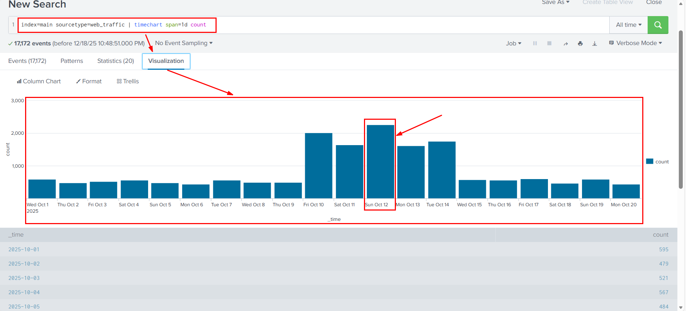
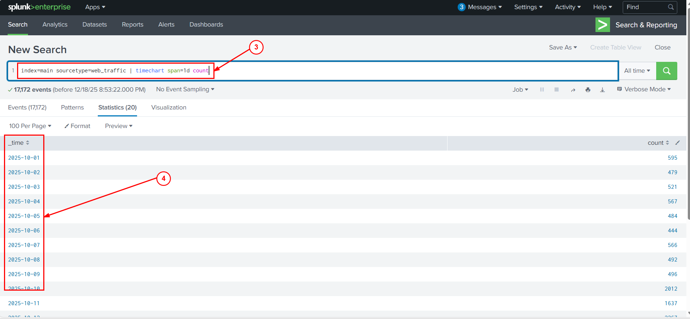

### Phase 2: Threat Hunting (The Kill Chain)

#### Step 1: Identification of the Threat Actor
I filtered the logs to isolate the most active IP addresses during the spike.
* **Attacker IP:** `198.51.100.55` was responsible for nearly 46% of all recorded traffic (7,876 events), marking it as the primary suspect.
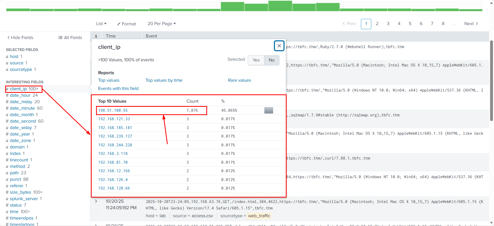
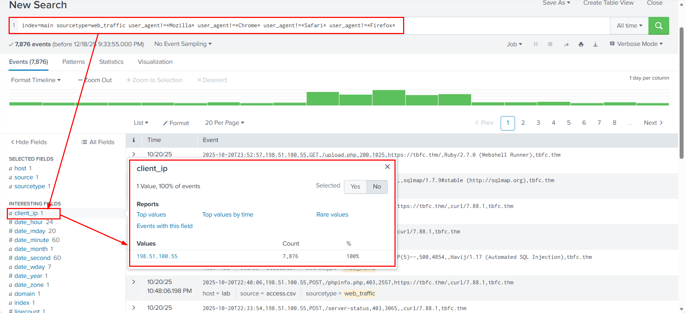

#### Step 2: Reconnaissance
The attacker initially probed the server using automated scanners. I identified this by filtering for non-standard User Agents.
* **Tools Used:** `zgrab`, `curl`, `Go-http-client`.
* **Targets:** Probing for sensitive files like `/.env`, `/phpinfo.php`, and `/.git/config`.
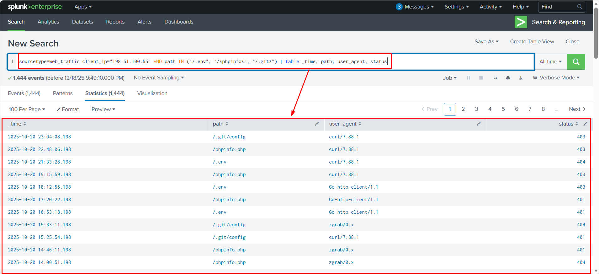

#### Step 3: Vulnerability Scanning & Exploitation
Further analysis of the `path` field revealed aggressive directory traversal attempts and SQL Injection probes.

**Directory Traversal:**
The attacker attempted to access system files (`/etc/passwd`) using `../` patterns.
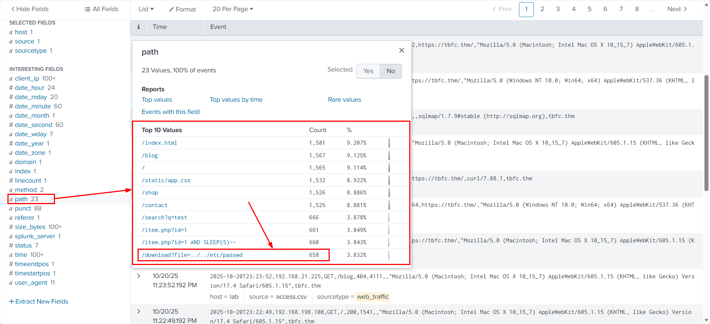
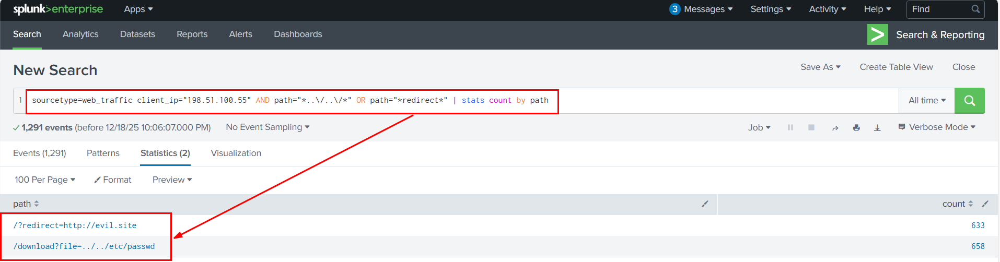

**SQL Injection:**
I detected the use of the `Havij` automated SQLi tool (993 events) and `sqlmap`, confirmed by specific payload signatures like `SLEEP(5)`.
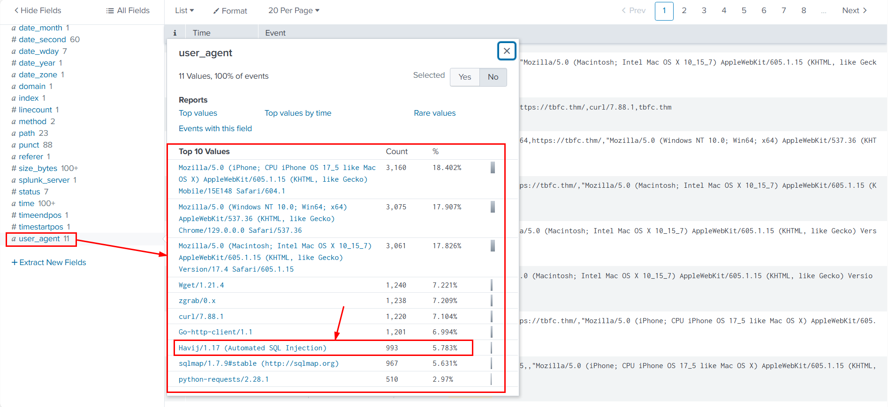
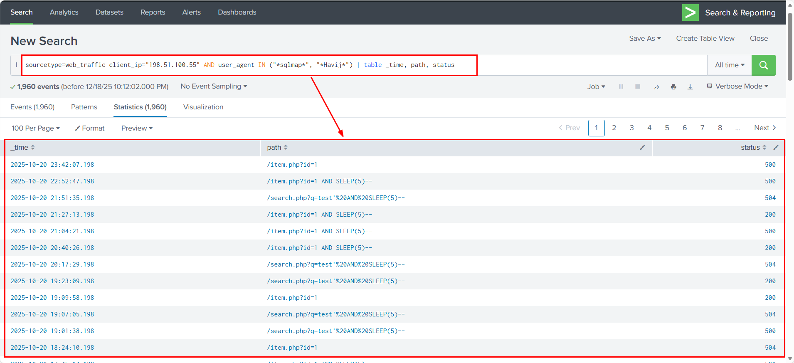

#### Step 4: Payload Delivery & Execution (RCE)
The attacker successfully uploaded a web shell. I tracked requests to `shell.php` and `bunnylock.bin`.
* **Web Shell:** `shell.php?cmd=` indicating Remote Code Execution (RCE).
* **Ransomware Payload:** Execution of `./bunnylock.bin`.
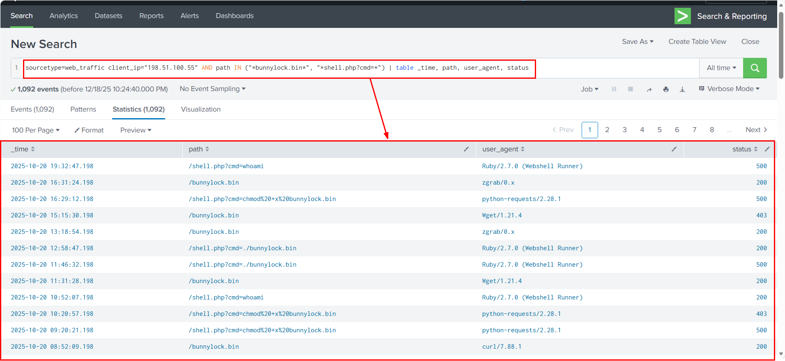

#### Step 5: Data Exfiltration (Action on Objectives)
The attacker was observed downloading sensitive archive files (`logs.tar.gz`, `backup.zip`) via the web interface.
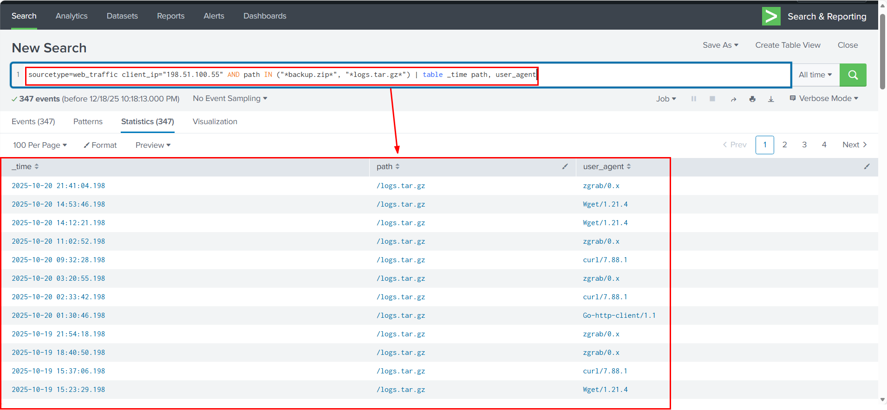

### Phase 3: Network Correlation (C2 Traffic)
Finally, I pivoted to the `firewall_logs` to confirm the data theft at the network layer.
* **C2 Connection:** The compromised server (`10.10.1.15`) initiated outbound connections to the attacker's IP (`198.51.100.55`) on port 8080.
* **Status:** The firewall action was `ALLOWED` with the reason `C2_CONTACT`.
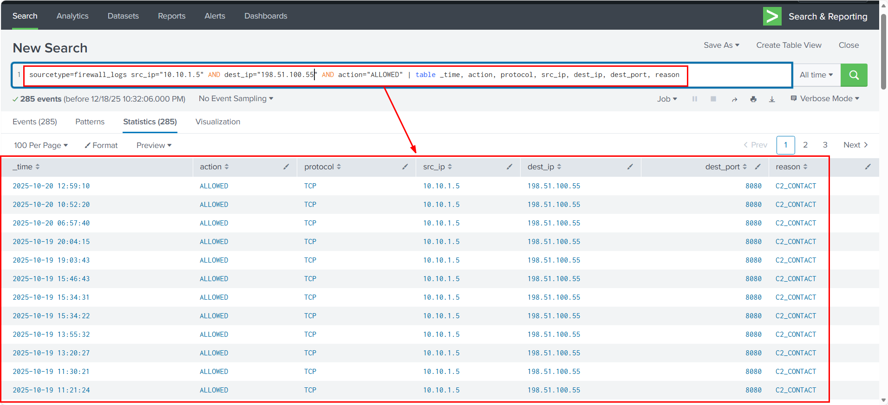

**Volume Analysis:**
A summation of the `bytes_transferred` field revealed that **126,167 bytes** of data were successfully exfiltrated.


---

## 3. Technical Analysis (SPL Queries)
The following Splunk Search Processing Language (SPL) queries were instrumental in this investigation:

**1. Isolating the Attacker:**
```splunk
index=main sourcetype=web_traffic user_agent!=*Mozilla* | stats count by client_ip 
| sort -count
Result: Identified 198.51.100.55 as the primary threat actor.

2. Detecting SQL Injection Tools:

Code snippet

sourcetype=web_traffic client_ip="198.51.100.55" AND user_agent IN ("*sqlmap*", "*Havij*") 
| table _time, path, status
3. Correlating C2 Traffic:

Code snippet

sourcetype=firewall_logs src_ip="10.10.1.15" dest_ip="198.51.100.55" action="ALLOWED"
| stats sum(bytes_transferred) by src_ip
4. Remediation & Lessons Learned
Immediate Actions
Block IP: Immediately block 198.51.100.55 at the perimeter firewall.

Isolate Host: Quarantine the web server (10.10.1.15) from the production network to prevent lateral movement.

Credential Reset: Reset all administrative credentials associated with the web server.

Strategic Recommendations
WAF Implementation: Deploy a Web Application Firewall (WAF) to block common attack signatures like SQLi (UNION SELECT) and Path Traversal (../).

User-Agent Filtering: Configure the web server to reject requests from known scanner User-Agents (e.g., Havij, zgrab).

Egress Filtering: Restrict outbound server traffic to only necessary IPs/Ports to prevent C2 callbacks.
